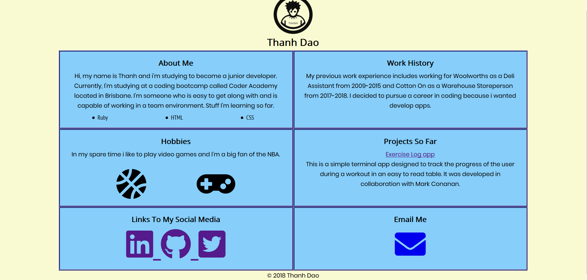
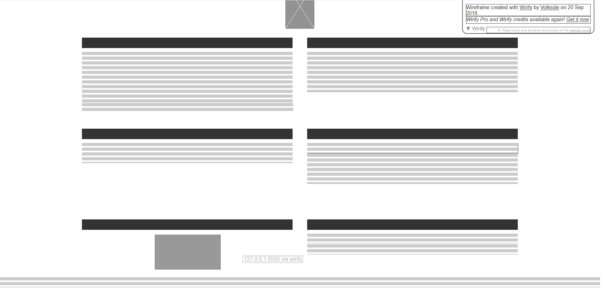
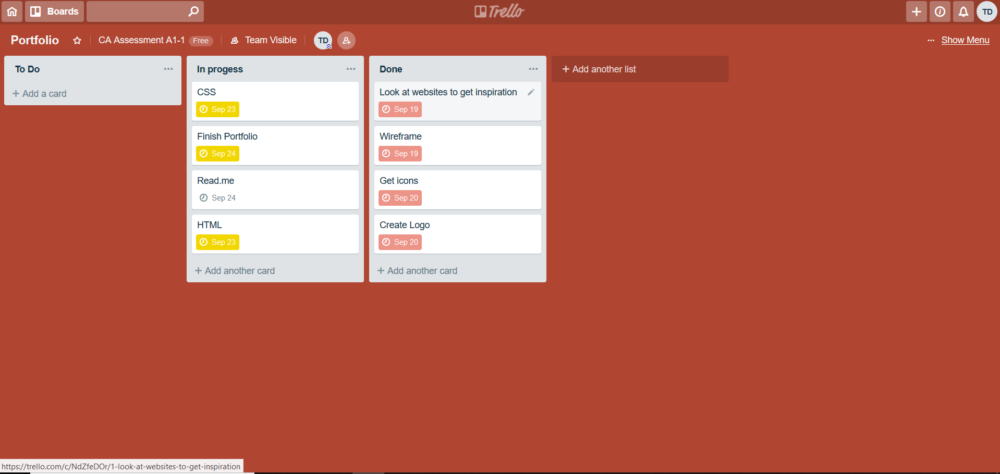

# Thanh Dao Portfolio

## Link to portfolio

## Link to GitHub repo
[Github Repository Link](https://github.com/thanhthedev/portfolio)

## Description

### Purpose
My personal portfolio which shows stuff about me to potential employers and teachers. To demonstrate my skills in HTML,CSS and Github while creating a portfolio.

### Functionality / features
About Me,  Work History, Hobbies, Projects So Far, Links To My Social Media, Email, Copyright and Logo.

### Screenshots

### Target audience
Potential employers and teachers.

### Tech stack (e.g. html, css, deployment platform, etc)
Used HTML, CSS and Github.  
## Design documentation

### Design process
1. Looked at other portfolios on the internet to get ideas.
2. Started looking at wireframes.
3. Started looking at sites to find icons. Decided going with fontawesome.com
4. Started looking at sites that can create logos for free. Went with logomkr.com
5. Didn't want to overestimate my abilities so i decided to go with a simple design instead of more complex design and risk not being completed in time. Also because this was my first portfolio.

### Wireframes

### Personal logo (optional)

### Usability considerations
Thought about adding a navigation bar but thought it was pointless because it was just one page. Also thought about adding a "back to the top" button but decided it was also pointless since it requires some javascript which i haven't yet learned and my portfolio page isnt very long. Made it responsive for just phones because it still looked good in tablets and desktops.

## Details of planning process

### Project plan & timeline
* 18th September - Look at other portfolios on internet to get ideas.
* 19th September - Wireframes.
* 20th September - Get icons and create logo.
* 23rd September - Finish HTML, CSS and read.me.
* 24th September - Make sure everything is completed and ready to present.

### Screenshots of Trello board(s)  

## History of the internet in the 1980s
* 1983 - Paul Mockapetris invents the Domain Name System (DNS).
* 1984 - The first email arrives in Germany from the U.S. 
* 1986 - Craig Partridge designs how email is routed using domain names.
* 1989 - Van Jacobson develops algorithms for the Transmission Control Protocol (TCP) that helps solve the problem of congestion.
* 1989 - Geoff Huston helps facilitate a large scale deployment of the internet to the Australia public.
* 1989 - Tim Berners-Lee Creates the World Wide Web

## Domains, Web Servers, DNS and Web Browsers
Domains are used to identify one or more IP Addresses. The Domain Naming System (DNS) is like a phone book for the internet. It keeps track of website names and links them to IP Addresses.
Webservers are computers that stores websites so that people can visit them on the internet. Web Browsers such as Google Chrome,Mozilla Firefox read these files and converts them into texts and images for you to view. 

## Internet Technologies Email
Email has changed the way we write to each other. Before email we had to send letters to a person through the post office which may take days to receive. Now we can open up a email service provder such as Gmail or Hotmail and send an email to a person and they receive it almost instantaneously. The cost of an email is free whereas sending a letter incurs some cost such as stamps.   